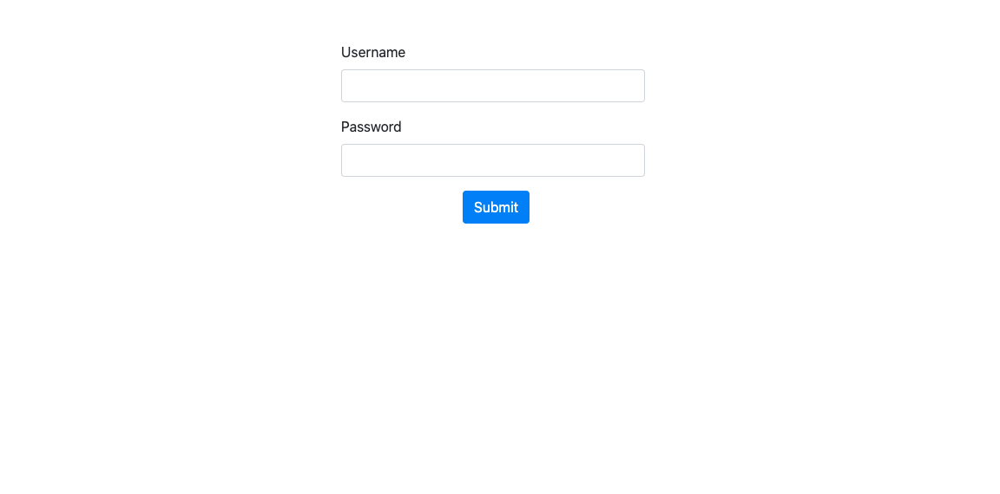
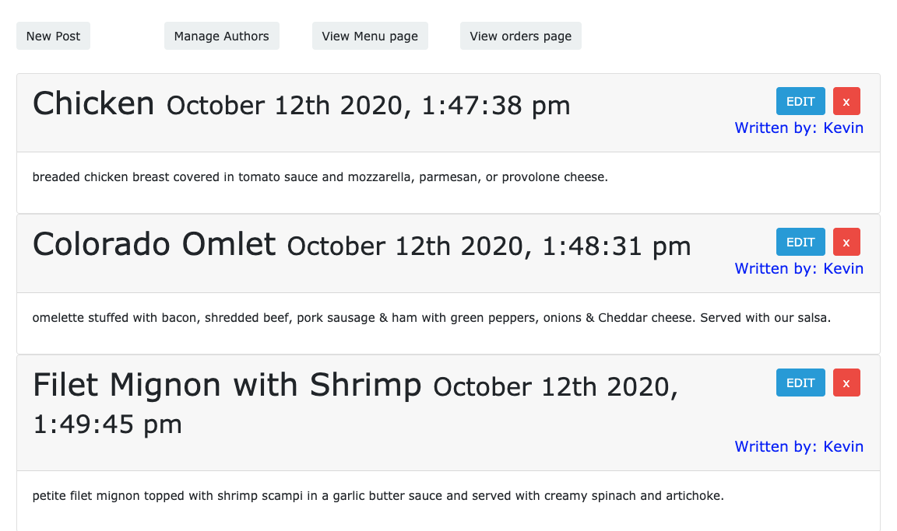
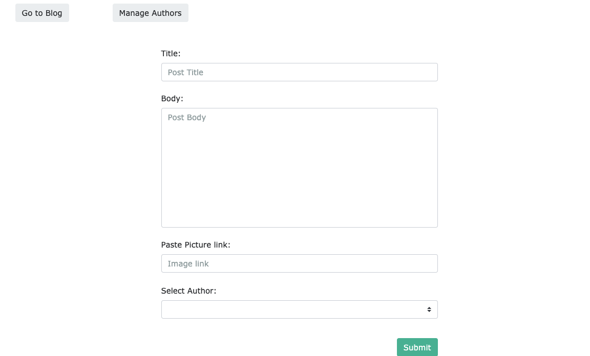
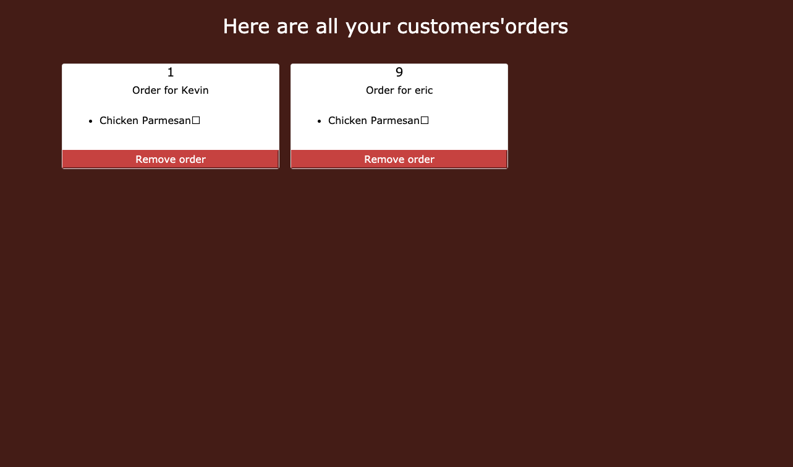
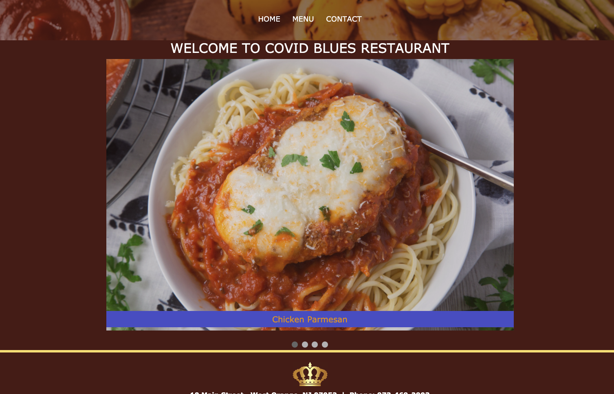
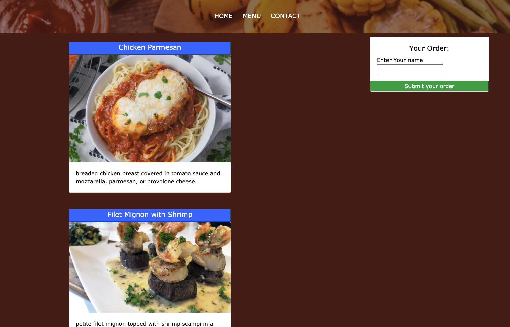
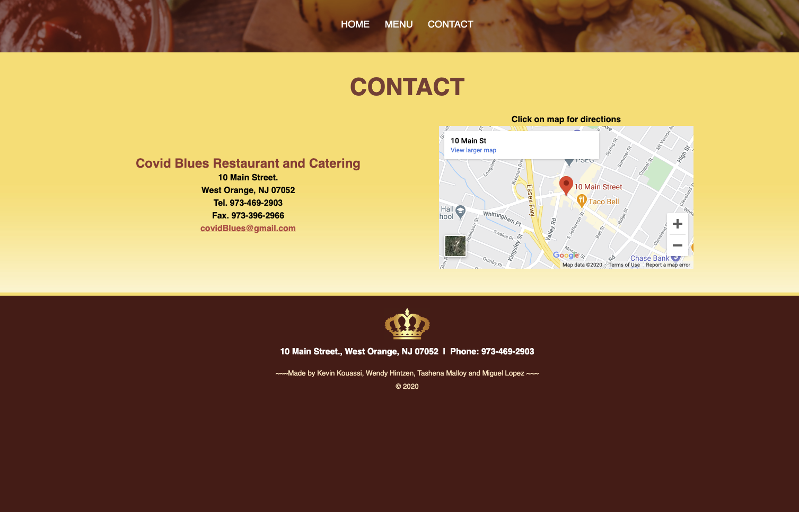

# Project 2: CMS of a restaurant website  

## Description
Concept: The concept of our project was to build a CMS App that would allow a Restaurant owner to be able to post new dishes to her/his restaurant website so that customers can view and order online.

The application has two UI, one for the owner where he can handle all the content of his website that generates the one of the customer.

## Table of contents
* [Description](#Description)
* [Usage](#Usage)
* [Tools_Used](#Tools_Used)
* [License](#License)
* [Contributing](#Contributing)
* [Screenshot](#Screenshot)
* [Links](#Links)
* [Dev-Team](#Dev-Team)
* [Questions](#Questions)

## Usage
##### The Owner (post to the website and view the orders): 
Add `/login` to the url to access the login page, enter the username:`username` and password:`password` to get to the blog page. Then click on `New Post` to reach the cms page for creating, fill the input fields, select an author and submit. After adding all posts, click on the `View Menu page` to view the updated website. 
To view the customer orders, click on the `View orders page`. Each order can be deleted on click of the `delete order` button. The orders page is reloaded every 10 seconds.

##### The Customer (view the website and make an order): 
The restaurant website has 3 pages; a `/home` for the home page which displays a slide of images posted by the owner in the cms interface. The `/menu` page which display all the dishes also posted by the owner and a contact page. Each dish is clickable. To order, click on the name of the dish, enter your name in the input filed and click on the `submit your order` button. Refresh the page to make a new order.  

## Licence
This app is under the MIT License.
## Contributing
We would be happy if anyone decide to improve it. All comments and suggestions are welcomed.
## Screenshot
##### What the owner uses:
        The login page:

        The blog page:

        The CMS page:

        The orders page:

##### What the customer uses:

The home page:

The menu page:

The contact page:

## Tools_Used
 - Node and Express Web server
 - Handlebars
 - MySql database
 - Sequelize

## Links to deployed App
- Owner: https://restaurant-cms-project2.herokuapp.com/login

- Customer: https://restaurant-cms-project2.herokuapp.com/ 
## Dev-Team
- Kouassi Kevin Kouadio (https://github.com/kevkouadio)
- Wendy Hintzen (https://github.com/whintzen)
- Miguel Lopez (https://github.com/chino6989)
- Tashena Malloy (https://github.com/Sheena15M)
## Questions
Contact me: kevkouadio@gmail.com or any member of the Dev Team.
